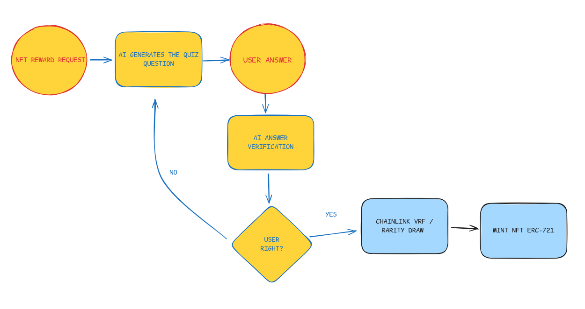

# 🦆 Quack Start Telegram Bot

A comprehensive Telegram bot for the DuckChain ecosystem, providing multilingual onboarding, AI-powered education, and NFT rewards.

## 🚀 Features

### 🌍 Multilingual Support
- **Languages**: Portuguese (PT), Spanish (ES), English (EN), Hindi (HI)
- **Dynamic Language Detection**: Automatic language detection using `franc-min`
- **Consistent Translation**: All bot interactions respect user's language preference

### 🎓 AI-Powered Onboarding System
- **Multi-Level Education**: Basic, Intermediate, and Advanced levels
- **Dynamic Questions**: AI-generated questions from Telegram community analysis
- **Fundamental Question**: "What is DuckChain?" always included in basic level
- **AI Responses**: Real-time answers using OpenRouter AI service
- **Adaptive Teaching Style**: AI adjusts language based on user experience level
- **Documentation Integration**: AI context from official DuckChain documentation
- **Automatic Translation**: Questions dynamically translated to user's language

### 🎁 NFT Quiz & Rewards
- **Interactive Quiz**: AI-generated questions based on DuckChain documentation
- **Smart Verification**: AI-powered answer checking
- **NFT Rewards**: Integration with campaign system for NFT distribution
- **Always Available**: Quiz button accessible throughout the onboarding

### 🔗 Smart Contract Integration
- **ERC-721 NFT Contract**: Chainlink VRF for transparent rarity
- **Campaign System**: Fixed supply campaigns with varying rarities
- **Owner-Only Creation**: Campaigns created only by contract owner
- **Economic Viability**: Cost-controlled NFT distribution

### 🤖 Telegram Community Scraping
- **Automatic Data Collection**: Weekly scraping of official DuckChain community
- **AI-Powered Analysis**: Intelligent question identification and categorization
- **Frequency Analysis**: Identifies most frequently asked questions
- **Dynamic Content**: Real-time question updates based on community needs
- **Transparent Process**: Respects Telegram terms and community guidelines

## 📋 Bot Flow

### 1. Welcome & Language Selection
```
User starts bot → Welcome message → Language selection (PT/ES/EN/HI)
```

### 2. Experience Assessment
```
Language selected → Experience question → 3 experience levels:
├── 🆕 Sou iniciante em blockchain
├── 🦆 Sou novo na rede DuckChain
└── 🚀 Já conheço
```

### 3. Onboarding Paths

#### 🆕 Blockchain Beginner Path
```
Blockchain beginner selected → Multi-level onboarding with didactic language:
├── Basic Level (5 questions) - Very didactic explanations
├── Intermediate Level (5 questions) - Didactic explanations
└── Advanced Level (5 questions) - Technical explanations
```

#### 🦆 DuckChain New Path
```
DuckChain new selected → Multi-level onboarding with normal language:
├── Basic Level (5 questions) - Standard explanations
├── Intermediate Level (5 questions) - Standard explanations
└── Advanced Level (5 questions) - Technical explanations
```

#### 🚀 Experienced Path
```
Experienced selected → Direct to DuckChain Mini App
```

### 4. Question Interaction
```
Question selected → AI generates response (adapted to user experience) → User can:
├── Ask another question
├── Go to next level
├── Access Mini App
└── Take NFT Quiz
```

### 5. NFT Quiz System
```
Quiz button clicked → AI generates DuckChain-specific question → User answers → AI verifies → NFT reward if correct
```

## 🛠 Technical Architecture

### System Architecture

#### **Onboarding Flow**


#### **NFT Minting Process**


### Core Services

#### `index.ts` - Main Bot Controller
- Telegraf bot setup and configuration
- Message and action handlers
- Language detection and routing
- Error handling and logging

#### `translations.ts` - Multilingual System
- Complete translation interface
- 4 language support (PT, ES, EN, HI)
- Dynamic text replacement
- Consistent user experience


#### `telegram-scraper.ts` - Community Analysis
- Automatic Telegram group scraping
- AI-powered question identification
- Frequency and relevance analysis
- Weekly scheduled execution
- JSON data export for onboarding integration

#### `onboarding-service.ts` - Onboarding Logic
- User state management with experience level tracking
- Question progression through difficulty levels
- AI integration with adaptive teaching styles
- Quiz system coordination
- Experience-based response customization
- Dynamic question loading from scraped data
- Automatic question translation to user's language

#### `openrouter-service.ts` - AI Integration
- OpenRouter API integration
- DuckChain documentation context
- Multilingual AI responses
- Error handling and fallbacks

#### `docs-service.ts` - Documentation Access
- Local markdown file reading
- DuckChain documentation integration
- AI context generation
- Structured content delivery

#### `sorteio-service.js` - Campaign Management
- NFT campaign simulation
- User participation tracking
- Campaign status management
- Integration with smart contracts

### Smart Contracts

#### `NFT-Reward.sol` - NFT Contract
- ERC-721 standard implementation
- Chainlink VRF integration
- Campaign-based distribution
- Rarity system (Common 90%, Rare 9%, Legendary 1%)
- Owner-only campaign creation

## 📁 Project Structure

```
quack-start/
├── index.ts                 # Main bot controller
├── translations.ts          # Multilingual translations
├── onboarding-questions.ts  # Multilingual questions
├── onboarding-service.ts    # Onboarding logic
├── openrouter-service.ts    # AI integration
├── docs-service.ts          # Documentation service
├── telegram-scraper.ts      # Community scraping & analysis
├── auto-scraper.js          # Automated scraping scheduler
├── sorteio-service.js       # Campaign management
├── package.json             # Dependencies
├── tsconfig.json           # TypeScript config
├── .env                    # Environment variables
├── duckchain-docs/         # Documentation files
│   ├── overview.md
│   └── token.md
├── duckchain-questions-*.json # Scraped community questions
└── nft-contract/           # Smart contract
    ├── contracts/
    │   └── NFT-Reward.sol
    ├── hardhat.config.js
    └── README.md
```

## 🔧 Setup & Installation

### Prerequisites
- Node.js 18+
- npm or yarn
- Telegram Bot Token
- OpenRouter API Key

### Environment Variables
```env
TELEGRAM_TOKEN=your_telegram_bot_token
OPENROUTER_API_KEY=your_openrouter_api_key

# Telegram Scraping (Optional)
TELEGRAM_API_ID=your_telegram_api_id
TELEGRAM_API_HASH=your_telegram_api_hash
TELEGRAM_SESSION_STRING=your_telegram_session_string
```

### Installation
```bash
# Install dependencies
npm install

# Start development server
npm run dev

# Build for production
npm run build

# Start production server
npm start
```

## 🎯 Key Features Explained

### Multilingual Onboarding
The bot provides a complete educational experience in the user's preferred language:
- **Language Detection**: Automatic detection using `franc-min`
- **Consistent Experience**: All interactions respect language choice
- **Localized Content**: Questions and responses in native language

### AI-Powered Education
Leverages OpenRouter AI with DuckChain documentation context:
- **Contextual Responses**: AI uses official documentation
- **Multilingual AI**: Responses in user's language
- **Adaptive Teaching**: Language adjusts based on user experience level
- **Real-time Learning**: Immediate answers to questions
- **Dynamic Questions**: Community-driven question generation
- **Automatic Translation**: Questions translated to user's language

### NFT Quiz System
Interactive reward system with educational value:
- **DuckChain-Specific**: Questions based on official documentation
- **AI Verification**: Smart answer checking
- **Immediate Rewards**: NFT claim upon correct answers
- **Always Accessible**: Available throughout onboarding

### Smart Contract Integration
Economic and transparent NFT distribution:
- **Chainlink VRF**: Verifiable randomness for rarity
- **Campaign System**: Controlled supply and costs
- **Owner Control**: Only contract owner can create campaigns
- **Economic Viability**: Cost-effective on L2 (Arbitrum Orbit)

### Telegram Community Scraping System
Intelligent community analysis for dynamic content:
- **Weekly Automation**: Scheduled scraping every 7 days
- **Official Community**: Focuses on @DuckChain_io (30K+ members)
- **AI Analysis**: Identifies most frequent and relevant questions
- **Question Categorization**: Basic, Intermediate, Advanced classification
- **Frequency Scoring**: 1-10 scale for question importance
- **JSON Export**: Structured data for onboarding integration
- **Automatic Translation**: Questions translated to user's language
- **Fallback System**: Static questions when scraping unavailable

## 🚀 Usage Examples

### Starting the Bot
```
/start → Language selection → Experience assessment (3 levels) → Onboarding with adapted AI responses
```

### Dynamic Question System
```
Weekly Scraping → AI Analysis → Question Categorization → Onboarding Integration:
├── Fundamental Question: "What is DuckChain?" (always included)
├── Dynamic Questions: Community-driven (frequency-based)
├── Automatic Translation: User's language
└── AI Responses: Contextual and adaptive
```

### Taking the Quiz
```
Click "🎁 Quer ganhar um NFT? Responda esse quiz!" → 
AI generates question → User answers → AI verifies → NFT reward
```

### Onboarding Flow
```
Experience Level Selection → 
├── Blockchain Beginner → Didactic AI responses → 
├── DuckChain New → Standard AI responses → 
└── Experienced → Direct to Mini App

Multi-level progression:
Basic questions → AI responses → 
Intermediate questions → AI responses → 
Advanced questions → AI responses → Completion
```

## 🎯 Adaptive AI Teaching System

### Experience-Based Response Customization

The bot intelligently adapts its teaching style based on user experience level:

#### 🆕 Blockchain Beginners
- **Didactic Language**: Step-by-step explanations with simple analogies
- **Patient Approach**: Clear, educational tone for complete newcomers
- **Basic & Intermediate Levels**: Very didactic responses
- **Advanced Level**: Technical responses

#### 🦆 DuckChain New Users
- **Standard Language**: Direct explanations without excessive didacticism
- **Network Focus**: Emphasis on DuckChain-specific features
- **All Levels**: Standard technical responses

#### 🚀 Experienced Users
- **Direct Access**: Immediate redirect to DuckChain Mini App
- **No Onboarding**: Skips educational content

## 🔮 Future Enhancements

- **Additional Languages**: Support for more languages
- **Advanced Analytics**: User engagement tracking
- **Enhanced AI**: More sophisticated question generation
- **DeFi Integration**: Direct wallet interactions
- **Community Features**: User interaction and gamification
- **Personalized Learning Paths**: Customized question sequences
- **Real-time Scraping**: More frequent community analysis
- **Sentiment Analysis**: Community mood and trending topics

## 📄 License

This project is part of the DuckChain ecosystem and follows the project's licensing terms.

---

**Built with ❤️ for the DuckChain community**
