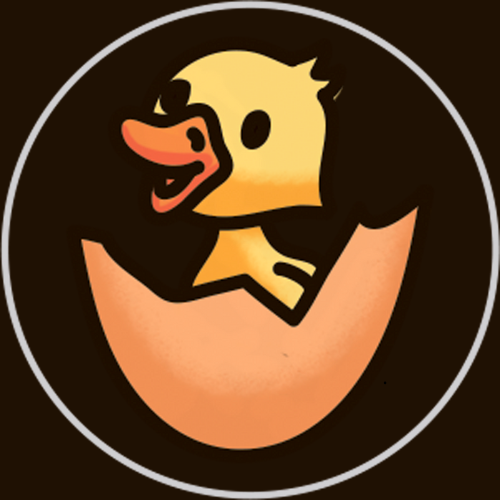

# Quack Start Telegram Bot



[](https://t.me/duck_start_bot)
[](https://ton.org/)
[](https://www.blockchain.com/)
[](https://duckchain.io/)
[](https://chain.link/)


---
A **multilingual and intelligent Telegram bot** that transforms confusion into engagement through AI-powered education and NFT rewards.

### 🎓 **Adaptive Learning System**

**3 experience levels for personalized onboarding:**

- **🆕 Blockchain Beginners**: Didactic explanations with analogies and step-by-step guidance
- **🦆 DuckChain New Users**: Focus on network-specific features
- **🚀 Experienced Users**: Direct access to Mini App

### 🌍 **Multilingual Accessibility**

- **4 languages**: Portuguese, Spanish, English, Hindi
- **Automatic language detection**
- **Consistent experience** across all interactions
- **Localized content** for each culture

### 🤖 **AI-Powered Education**

- **Community-Generated Questions**: Weekly analysis of official DuckChain community (30K+ members)
- **Dynamic Content**: Questions based on most frequently asked community questions
- **Real-time responses** using AI with official documentation context
- **Adaptive teaching** based on experience level with personalized explanations
- **Automatic translation**: Questions dynamically translated to user's language

### 🎁 **Gamified Engagement**

- **NFT Quiz System**: Interactive rewards for learning
- **Community-Driven Questions**: AI-generated questions from official DuckChain community analysis
- **Smart Verification**: AI-powered answer checking with immediate feedback
- **NFT Rarity System**: NFTs with varying rarities create differential experiences
- **Exclusive Benefits**: Rare and Legendary NFTs unlock premium AI tools and community features

---

## 🚀 **Technical Architecture**

Our solution is built with modern and scalable technologies:

### **Core Components**
- **Telegraf**: Robust Telegram integration
- **TypeScript**: Type-safe and maintainable code
- **OpenRouter AI**: Integration with advanced language models
- **Smart Contracts**: Chainlink VRF for transparent randomness
- **Documentation Service**: Local markdown integration for AI context


### **User Flow**
```
Welcome → Language Detection → Experience Assessment → 
Personalized Onboarding → AI Responses → NFT Rewards
```

### **Smart Integration**
- **Community scraping**: Weekly analysis of official DuckChain community
- **Dynamic questions**: Based on most frequent community questions
- **Automatic translation**: Questions translated to user's language
- **Campaign system**: NFTs with controlled rarities via Chainlink VRF

> 📖 **For complete technical details, see [Architecture.md](Architecture.md)**

---

## 📈 **Impact & Results**

### **User Experience Transformation**
- **Reduced confusion**: Clear and structured learning paths
- **Increased engagement**: Gamified rewards system
- **Linguistic accessibility**: Breaking international barriers
- **Personalized learning**: Adaptive content based on experience level

### **Ecosystem Benefits**
- **Lower abandonment**: Guided onboarding reduces user drop-off
- **Higher retention**: Educational content builds user commitment
- **Global reach**: Multilingual support expands market access
- **Community building**: Interactive learning fosters user connection

---

## 🔮 **Future Vision**

Our solution creates a foundation for:
- **Expanded language support**: Additional languages and regional adaptations
- **Advanced analytics**: Engagement tracking and optimization
- **Enhanced AI**: More sophisticated question generation and personalization


---

## 🎯 **Why Our Solution is the Best?**

### **Real Problem vs. Real Solution**
While other solutions focus on **features** or **interface**, we solve the **fundamental problem**: **confused users who abandon before understanding the value**.

### **Clear Differentiation**
- **Education before transaction**: Users understand before investing
- **Global accessibility**: Breaking language barriers
- **Sustainable engagement**: Reward system that encourages learning
- **Proven scalability**: Modular architecture for growth

### **Measurable Result**
We transform the traditional journey of **"confusion and abandonment"** into an **engaging, educational, and rewarding experience** that drives real ecosystem growth.


## 🧪 **Ready to Test?**

**Experience the future of Web3 onboarding right now!**

👉 **[Test the Bot Here](https://t.me/duck_start_bot)** 👈

*Start your personalized DuckChain journey in just a few clicks!*

---

**Built with ❤️ for the DuckChain community and the future of Web3 accessibility**

> 🦆 **DuckChain: The Telegram AI Chain**  
> *Empowering 1 billion+ Telegram users with AI-driven Web3 solutions*

---

